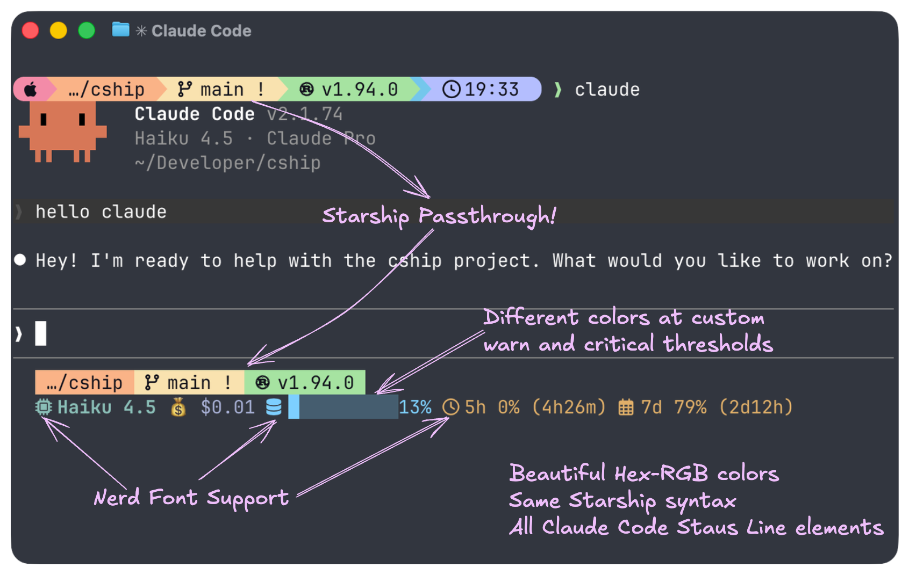
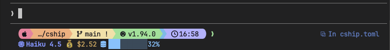

# ⚓ CShip (pronounced "sea ship")

[](https://github.com/stephenleo/cship/actions/workflows/ci.yml)
[](https://crates.io/crates/cship)
[](https://crates.io/crates/cship)
[](https://github.com/stephenleo/cship/releases/latest)
[](https://github.com/stephenleo/cship/releases)
[](https://github.com/stephenleo/cship/blob/main/LICENSE)

**Beautiful, Blazing-fast, Customizable Claude Code Statusline.**



`cship` renders a live statusline for [Claude Code](https://claude.ai/code) sessions, showing session cost, context window usage, model name, API usage limits, and more — all configurable via a simple TOML file.

### Key features:
- 🎨 Fully Customizable: Configure every module with Starship-compatible TOML. Colors, symbols, thresholds — your statusline, your rules.
- ⚡ Blazing Fast: Written in Rust with a ≤10ms render budget.
- 🔌 Starship Passthrough: Embed any [Starship](https://starship.rs) module (git_branch, directory, language runtimes) right next to native CShip modules.
- 💰 Session Insights: Track cost, context window usage, API limits, vim mode, agent name, and more — all from Claude Code's live JSON feed. Implement custom warn and critical thresholds with custom colors for each. 

## 🚀 Install

### ⚡ Method 1a: curl installer (macOS / Linux)

```sh
curl -fsSL https://cship.dev/install.sh | bash
```

Auto-detects your OS and architecture (macOS arm64/x86_64, Linux x86_64/aarch64), downloads the binary to `~/.local/bin/cship`, creates a starter config at `~/.config/cship.toml`, and wires the `statusLine` entry in `~/.claude/settings.json`.

Optional dependencies ([Starship](https://starship.rs) for passthrough modules, and `libsecret-tools` on Linux for usage limits) are handled as follows:

- **Interactive terminal** — the installer prompts you for each.
- **`--yes` / `-y`** — auto-installs all optional deps without prompting:
  ```sh
  curl -fsSL https://cship.dev/install.sh | bash -s -- --yes
  ```
- **Non-interactive** (Docker `RUN`, CI pipelines, no TTY) — optional deps are skipped automatically; the installer prints instructions for manual installation.

### 🪟 Method 1b: PowerShell installer (Windows)

Run this one-liner in PowerShell (5.1 or later):

```powershell
irm https://cship.dev/install.ps1 | iex
```

Installs to `%USERPROFILE%\.local\bin\cship.exe`, writes config to `%USERPROFILE%\.config\cship.toml`, and registers the statusline in `%USERPROFILE%\.claude\settings.json`.

> You can inspect the script before running: [install.ps1](https://cship.dev/install.ps1)

### 📦 Method 2: cargo install

Requires the Rust toolchain.

```sh
cargo install cship
```

After installing with `cargo` on **macOS / Linux**, wire the statusline manually in `~/.claude/settings.json`:

```json
{
  "statusLine": { "type": "command", "command": "cship" }
}
```

After installing with `cargo` on **Windows**, wire the statusline manually in `%APPDATA%\\Claude\\settings.json`:

```json
{
  "statusLine": { "type": "command", "command": "cship" }
}
```

## ⚙️ Configuration

- The default config file is `~/.config/cship.toml` (on Windows: `%USERPROFILE%\.config\cship.toml`).
- You can also place a `cship.toml` in your project root for per-project overrides. 
- The `lines` array defines the rows of your statusline. 
- Each element is a format string mixing `$cship.<module>` tokens (native cship modules) with Starship module tokens (e.g. `$git_branch`). 

A minimal working example:

```toml
[cship]
lines = ["$cship.model $cship.cost $cship.context_bar"]
```


### 🎨 Styling example

```toml
[cship]
lines = ["$cship.model $cship.cost $cship.context_bar"]

[cship.cost]
warn_threshold = 1.0
warn_style = "bold yellow"
critical_threshold = 5.0
critical_style = "bold red"
```


### 🧩 Available modules

Everything in the [Claude Code status line documentation](https://code.claude.com/docs/en/statusline#available-data) is available as a `$cship.<module>` token for you to mix and match in the `lines` format strings. Here are the most popular ones:

| Token | Description |
|-------|-------------|
| `$starship_prompt` | Full rendered Starship prompt (all configured modules in one row) |
| `$cship.model` | Claude model name |
| `$cship.cost` | Session cost (configurable currency; default `$X.XX`) |
| `$cship.context_bar` | Visual progress bar of context window usage |
| `$cship.context_window` | Context window tokens (used/total) |
| `$cship.context_window.used_tokens` | Real token count in context with percentage (e.g. `8%(79k/1000k)`) |
| `$cship.usage_limits` | API usage limits (5hr / 7-day, plus per-model and extra-usage when available) |
| `$cship.usage_limits.per_model` | 7-day per-model breakdown (opus / sonnet / cowork / oauth) |
| `$cship.usage_limits.extra_usage` | Extra-credits section with `{active}` indicator |
| `$cship.peak_usage` | Peak-time indicator (US Pacific business hours) |
| `$cship.agent` | Sub-agent name |
| `$cship.session` | Session identity info |
| `$cship.workspace` | Workspace/project directory |

Full configuration reference: **https://cship.dev**

## 🔍 Debugging

Run `cship explain` to inspect what cship sees from Claude Code's context JSON — useful when a module shows nothing or behaves unexpectedly.

```sh
cship explain
```

To check the installed binary version:

```sh
cship --version   # or: cship -v
```

## ✨ Showcase

Six ready-to-use configurations — from minimal to full-featured. Each can be dropped into `~/.config/cship.toml`.

---

### 1. 🪶 Minimal

One clean row. Model, cost with colour thresholds, context bar.


<details>
<summary>View config</summary>

```toml
[cship]
lines = ["$cship.model  $cship.cost  $cship.context_bar"]

[cship.cost]
style              = "green"
warn_threshold     = 2.0
warn_style         = "yellow"
critical_threshold = 5.0
critical_style     = "bold red"

[cship.context_bar]
width              = 10
warn_threshold     = 40.0
warn_style         = "yellow"
critical_threshold = 70.0
critical_style     = "bold red"
```

</details>

---

### 2. 🌿 Git-Aware Developer

Two rows: Starship git status on top, Claude session below. Starship passthrough (`$directory`, `$git_branch`, `$git_status`) requires [Starship](https://starship.rs) to be installed.


<details>
<summary>View config</summary>

```toml
[cship]
lines = [
  "$directory $git_branch $git_status",
  "$cship.model  $cship.cost  $cship.context_bar",
]

[cship.model]
symbol = "🤖 "
style  = "bold cyan"

[cship.cost]
warn_threshold     = 2.0
warn_style         = "yellow"
critical_threshold = 5.0
critical_style     = "bold red"

[cship.context_bar]
width              = 10
warn_threshold     = 40.0
warn_style         = "yellow"
critical_threshold = 70.0
critical_style     = "bold red"
```

</details>

---

### 3. 💰 Cost Guardian

Shows cost, lines changed, rolling API usage limits, and a peak-time indicator. Colour escalates as budgets fill.


<details>
<summary>View config</summary>

```toml
[cship]
lines = [
  "$cship.model $cship.cost +$cship.cost.total_lines_added -$cship.cost.total_lines_removed",
  "$cship.context_bar $cship.usage_limits $cship.peak_usage",
]

[cship.model]
style = "bold purple"

[cship.cost]
warn_threshold     = 1.0
warn_style         = "bold yellow"
critical_threshold = 3.0
critical_style     = "bold red"

[cship.context_bar]
width              = 10
warn_threshold     = 40.0
warn_style         = "yellow"
critical_threshold = 70.0
critical_style     = "bold red"

[cship.usage_limits]
ttl                = 60        # cache TTL in seconds; increase if running many concurrent sessions
five_hour_format   = "5h {pct}%"
seven_day_format   = "7d {pct}%"
separator          = " "
warn_threshold     = 70.0
warn_style         = "bold yellow"
critical_threshold = 90.0
critical_style     = "bold red"

[cship.peak_usage]
style = "bold yellow"
```

</details>

---

### 4. 🎨 Material Hex

Every style value is a `fg:#rrggbb` hex colour — no named colours anywhere. Amber warns, coral criticals.


<details>
<summary>View config</summary>

```toml
[cship]
lines = [
  "$cship.model $cship.cost",
  "$cship.context_bar $cship.usage_limits",
]

[cship.model]
style = "fg:#c3e88d"

[cship.cost]
style              = "fg:#82aaff"
warn_threshold     = 2.0
warn_style         = "fg:#ffcb6b"
critical_threshold = 6.0
critical_style     = "bold fg:#f07178"

[cship.context_bar]
width              = 10
style              = "fg:#89ddff"
warn_threshold     = 40.0
warn_style         = "fg:#ffcb6b"
critical_threshold = 70.0
critical_style     = "bold fg:#f07178"

[cship.usage_limits]
five_hour_format   = "5h {pct}%"
seven_day_format   = "7d {pct}%"
separator          = " "
warn_threshold     = 70.0
warn_style         = "fg:#ffcb6b"
critical_threshold = 90.0
critical_style     = "bold fg:#f07178"
```

</details>

---

### 5. 🌃 Tokyo Night

Three-row layout for polyglot developers. Starship handles language runtimes and git; cship handles session data. Styled with the [Tokyo Night](https://github.com/folke/tokyonight.nvim) colour palette.


<details>
<summary>View config</summary>

```toml
[cship]
lines = [
  """
  $directory\
  $git_branch\
  $git_status\
  $python\
  $nodejs\
  $rust
  """,
  "$cship.model $cship.agent",
  "$cship.context_bar $cship.cost $cship.usage_limits",
]

[cship.model]
symbol = "🤖 "
style  = "bold fg:#7aa2f7"

[cship.agent]
symbol = "↳ "
style  = "fg:#9ece6a"

[cship.context_bar]
width              = 10
style              = "fg:#7dcfff"
warn_threshold     = 40.0
warn_style         = "fg:#e0af68"
critical_threshold = 70.0
critical_style     = "bold fg:#f7768e"

[cship.cost]
symbol             = "💰 "
style              = "fg:#a9b1d6"
warn_threshold     = 2.0
warn_style         = "fg:#e0af68"
critical_threshold = 5.0
critical_style     = "bold fg:#f7768e"

[cship.usage_limits]
five_hour_format   = "⌛ 5h {pct}%"
seven_day_format   = "📅 7d {pct}%"
separator          = " "
warn_threshold     = 70.0
warn_style         = "fg:#e0af68"
critical_threshold = 90.0
critical_style     = "bold fg:#f7768e"
```

</details>

---

### 6. 🔤 Nerd Fonts

Requires a [Nerd Font](https://www.nerdfonts.com) in your terminal. Icons are embedded as `symbol` values on each module and as literal characters in the format string for Starship passthrough rows. You can use `format` to control how the symbol and value are combined for each module exactly like you'd do with Starship.


<details>
<summary>View config</summary>

```toml
[cship]
lines = [
  """
  $directory\
  $git_branch\
  $git_status\
  $python\
  $nodejs\
  $rust
  """,
  "$cship.model $cship.cost $cship.context_bar $cship.usage_limits",
]

[cship.model]
symbol = " "
style  = "bold fg:#7aa2f7"

[cship.cost]
symbol             = "💰 "
style              = "fg:#a9b1d6"
warn_threshold     = 2.0
warn_style         = "fg:#e0af68"
critical_threshold = 5.0
critical_style     = "bold fg:#f7768e"

[cship.context_bar]
symbol             = " "
format             = "[$symbol$value]($style)"
width              = 10
style              = "fg:#7dcfff"
warn_threshold     = 40.0
warn_style         = "fg:#e0af68"
critical_threshold = 70.0
critical_style     = "bold fg:#f7768e"

[cship.usage_limits]
five_hour_format   = "⌛ 5h {pct}%"
seven_day_format   = "📅 7d {pct}%"
separator          = " "
warn_threshold     = 70.0
warn_style         = "fg:#e0af68"
critical_threshold = 90.0
critical_style     = "bold fg:#f7768e"
```

</details>

---

### 7. 🌌 Full Starship Prompt

Two-row layout featuring the complete rendered Starship prompt on top and Claude Code session data on bottom. `$starship_prompt` invokes `starship prompt` to display your entire Starship configuration (directory, git status, language runtimes, and any custom modules) in a single call.



<details>
<summary>View config</summary>

```toml
[cship]
lines = [
  "$starship_prompt",
  "$cship.model $cship.cost $cship.context_bar $cship.usage_limits",
]

[cship.model]
symbol = " "
style  = "bold fg:#7aa2f7"

[cship.cost]
symbol             = "💰 "
style              = "fg:#a9b1d6"
warn_threshold     = 2.0
warn_style         = "fg:#e0af68"
critical_threshold = 5.0
critical_style     = "bold fg:#f7768e"

[cship.context_bar]
symbol             = " "
format             = "[$symbol$value]($style)"
width              = 10
style              = "fg:#7dcfff"
warn_threshold     = 40.0
warn_style         = "fg:#e0af68"
critical_threshold = 70.0
critical_style     = "bold fg:#f7768e"

[cship.usage_limits]
five_hour_format   = "⌛ 5h {pct}%"
seven_day_format   = "📅 7d {pct}%"
separator          = " "
warn_threshold     = 70.0
warn_style         = "fg:#e0af68"
critical_threshold = 90.0
critical_style     = "bold fg:#f7768e"
```

</details>

---

## 📚 Full documentation

→ **[cship.dev](https://cship.dev)**

Complete configuration reference, format string syntax, all module options, and examples.

---

If you found this project useful, please give us a star ⭐ on [GitHub](https://github.com/stephenleo/cship)!

If you find bugs or have suggestions, open an issue or submit a pull request. Contributions are very welcome!

Before submitting a PR, run the following to match what CI checks:

```sh
cargo fmt && cargo clippy -- -D warnings && cargo test && cargo build --release
```

See [CONTRIBUTING.md](CONTRIBUTING.md) for full details.

## 💡 Inspiration
- Inspired by [starship](https://starship.rs), built with Rust and the [Claude Code status line API](https://code.claude.com/docs/en/statusline).

## 📄 License

Apache-2.0
