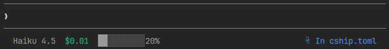
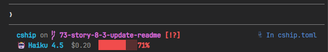
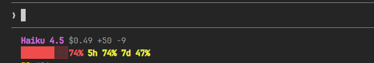
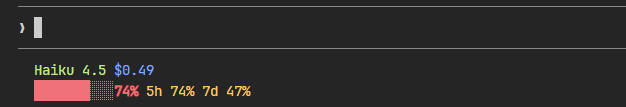
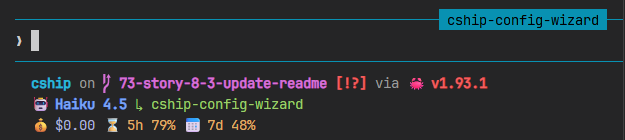
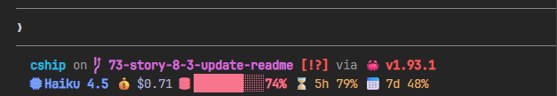

# Showcase

Ready-to-use `cship.toml` configurations — from minimal to full-featured. Each can be dropped into `~/.config/cship.toml`.


---

## 1. Minimal

One clean row. Model, cost with colour thresholds, context bar.



```toml
[cship]
lines = ["$cship.model  $cship.cost  $cship.context_bar"]

[cship.cost]
style              = "green"
warn_threshold     = 2.0
warn_style         = "yellow"
critical_threshold = 5.0
critical_style     = "bold red"

[cship.context_bar]
width              = 10
warn_threshold     = 40.0
warn_style         = "yellow"
critical_threshold = 70.0
critical_style     = "bold red"
```

---

## 2. Git-Aware Developer

Two rows: Starship git status on top, Claude session below.

Starship passthrough (`$directory`, `$git_branch`, `$git_status`) requires [Starship](https://starship.rs) to be installed.



```toml
[cship]
lines = [
  "$directory $git_branch $git_status",
  "$cship.model  $cship.cost  $cship.context_bar",
]

[cship.model]
symbol = "🤖 "
style  = "bold cyan"

[cship.cost]
warn_threshold     = 2.0
warn_style         = "yellow"
critical_threshold = 5.0
critical_style     = "bold red"

[cship.context_bar]
width              = 10
warn_threshold     = 40.0
warn_style         = "yellow"
critical_threshold = 70.0
critical_style     = "bold red"
```

---

## 3. Cost Guardian

Shows cost, lines changed, and rolling API usage limits all at once. Colour escalates as budgets fill.



```toml
[cship]
lines = [
  "$cship.model $cship.cost +$cship.cost.total_lines_added -$cship.cost.total_lines_removed",
  "$cship.context_bar $cship.usage_limits",
]

[cship.model]
style = "bold purple"

[cship.cost]
warn_threshold     = 1.0
warn_style         = "bold yellow"
critical_threshold = 3.0
critical_style     = "bold red"

[cship.context_bar]
width              = 10
warn_threshold     = 40.0
warn_style         = "yellow"
critical_threshold = 70.0
critical_style     = "bold red"

[cship.usage_limits]
five_hour_format   = "5h {pct}%"
seven_day_format   = "7d {pct}%"
separator          = " "
warn_threshold     = 70.0
warn_style         = "bold yellow"
critical_threshold = 90.0
critical_style     = "bold red"
```

---

## 4. Material Hex

Every style value is a `fg:#rrggbb` hex colour — no named colours anywhere. Amber warns, coral criticals.



```toml
[cship]
lines = [
  "$cship.model $cship.cost",
  "$cship.context_bar $cship.usage_limits",
]

[cship.model]
style = "fg:#c3e88d"

[cship.cost]
style              = "fg:#82aaff"
warn_threshold     = 2.0
warn_style         = "fg:#ffcb6b"
critical_threshold = 6.0
critical_style     = "bold fg:#f07178"

[cship.context_bar]
width              = 10
style              = "fg:#89ddff"
warn_threshold     = 40.0
warn_style         = "fg:#ffcb6b"
critical_threshold = 70.0
critical_style     = "bold fg:#f07178"

[cship.usage_limits]
five_hour_format   = "5h {pct}%"
seven_day_format   = "7d {pct}%"
separator          = " "
warn_threshold     = 70.0
warn_style         = "fg:#ffcb6b"
critical_threshold = 90.0
critical_style     = "bold fg:#f07178"
```

---

## 5. Tokyo Night

Three-row layout for polyglot developers. Starship handles language runtimes and git; cship handles session data. Styled with the [Tokyo Night](https://github.com/folke/tokyonight.nvim) colour palette.



```toml
[cship]
lines = [
  """
  $directory\
  $git_branch\
  $git_status\
  $python\
  $nodejs\
  $rust
  """,
  "$cship.model $cship.agent",
  "$cship.context_bar $cship.cost $cship.usage_limits",
]

[cship.model]
symbol = "🤖 "
style  = "bold fg:#7aa2f7"

[cship.agent]
symbol = "↳ "
style  = "fg:#9ece6a"

[cship.context_bar]
width              = 10
style              = "fg:#7dcfff"
warn_threshold     = 40.0
warn_style         = "fg:#e0af68"
critical_threshold = 70.0
critical_style     = "bold fg:#f7768e"

[cship.cost]
symbol             = "💰 "
style              = "fg:#a9b1d6"
warn_threshold     = 2.0
warn_style         = "fg:#e0af68"
critical_threshold = 5.0
critical_style     = "bold fg:#f7768e"

[cship.usage_limits]
five_hour_format   = "⌛ 5h {pct}%"
seven_day_format   = "📅 7d {pct}%"
separator          = " "
warn_threshold     = 70.0
warn_style         = "fg:#e0af68"
critical_threshold = 90.0
critical_style     = "bold fg:#f7768e"
```

---

## 6. Nerd Fonts

Requires a [Nerd Font](https://www.nerdfonts.com) in your terminal. Icons are embedded as `symbol` values on each module and as literal characters in the format string for Starship passthrough rows.



```toml
[cship]
lines = [
  """
  $directory\
  $git_branch\
  $git_status\
  $python\
  $nodejs\
  $rust
  """,
  "$cship.model $cship.cost $cship.context_bar $cship.usage_limits",
]

[cship.model]
symbol = " " # nf-fa-microchip
style  = "bold fg:#7aa2f7"

[cship.cost]
symbol             = "💰 "
style              = "fg:#a9b1d6"
warn_threshold     = 2.0
warn_style         = "fg:#e0af68"
critical_threshold = 5.0
critical_style     = "bold fg:#f7768e"

[cship.context_bar]
symbol             = " " # nf-fa-database
format             = "[$symbol$value]($style)"
width              = 10
style              = "fg:#7dcfff"
warn_threshold     = 40.0
warn_style         = "fg:#e0af68"
critical_threshold = 70.0
critical_style     = "bold fg:#f7768e"

[cship.usage_limits]
five_hour_format   = "⌛ 5h {pct}%"
seven_day_format   = "📅 7d {pct}%"
separator          = " "
warn_threshold     = 70.0
warn_style         = "fg:#e0af68"
critical_threshold = 90.0
critical_style     = "bold fg:#f7768e"
```

---

## Submit Your Config

Have a beautiful CShip setup? Share it with the community!

Open a pull request to [stephenleo/cship](https://github.com/stephenleo/cship) adding your config to this page.

Include:
- A screenshot or GIF of your statusline in action
- Your full annotated `cship.toml`
- A short description of the design choices
